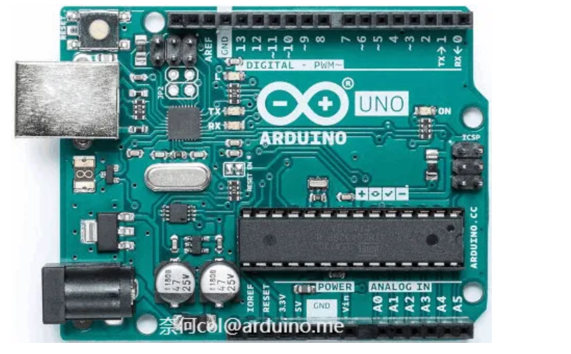
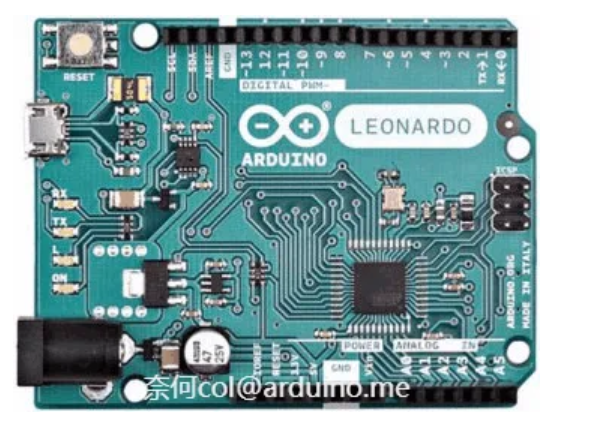
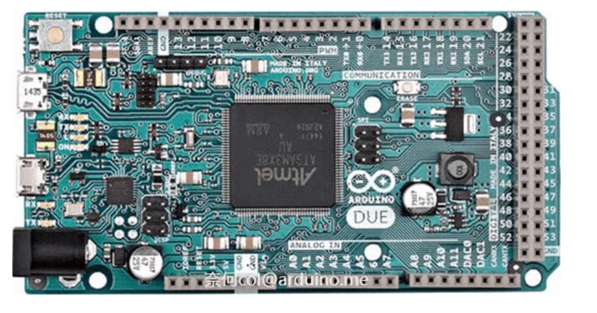
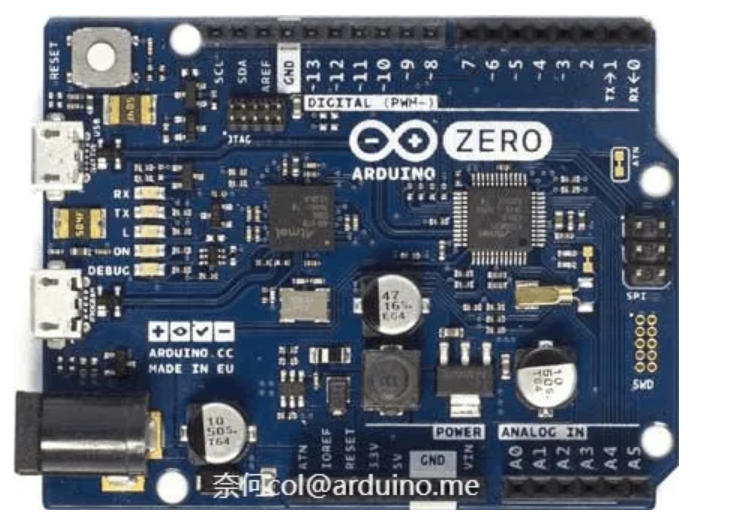
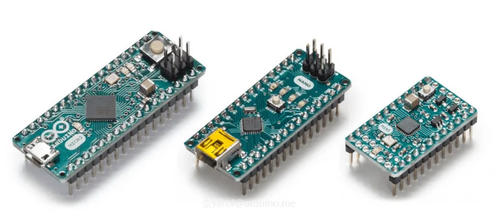
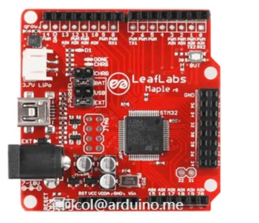
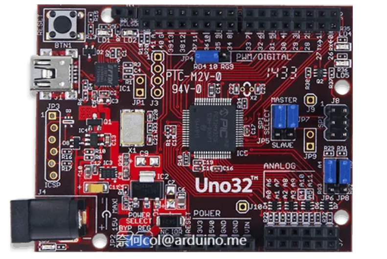
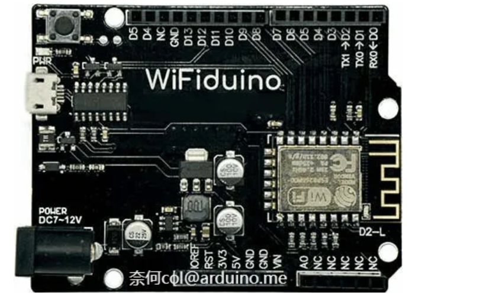
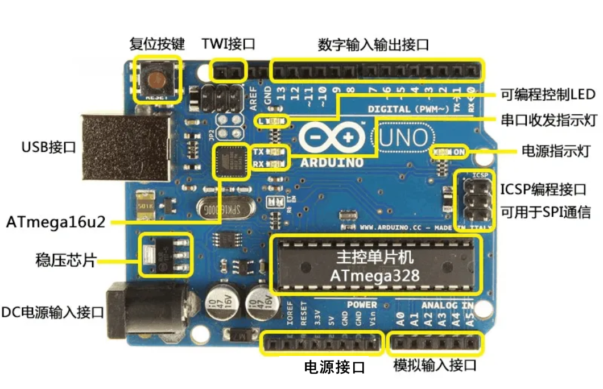

## 初识Arduino

### 简介

Arduino并不仅仅是一块小小的电路板，而是一个开放的电子开发平台。它包含了硬件——电路板、软件——开发环境，还有许许多多开发者、使用者创造的代码、程序、电路、项目。

### 热度

Arduino自2005年推出以来，广受好评，如今已成为最热门的开源硬件之一。在全球最大的开源社区Github上，Arduino已经成为了一个语言分类；而IEEE发布的2017年编程语言流行程度排行榜上，Arduino成为了仅次于C/C++的嵌入式编程语言；近年来，国内各大高校，甚至中小学都开始使用Arduino开展教学工作。Arduino的热门程度可见一斑。

### Arduino开发语言

Arduino编译器使用的是GCC，这是GNU开源计划的核心，使用最为广泛的编译器之一；Arduino语言衍生自Wiring语言，这是一个开源的单片机编程架构，同时Arduino语言又是基于AVR libc这个AVR单片机扩展库编写的，AVR libc也是一个优秀的开源项目；Arduino集成开发环境是基于Processing集成开发环境的，Processing是一个为设计师设计新型语言，当然这也是一个开源项目。Processing集成开发环境是由Java编写的，Java是众多周知的开源项目；

### Arduino 开发板分类

#### Arduino UNO

Arduino UNO是目前使用最广泛的Arduino控制器，具有Arduino的所有基础功能，是初学者的最佳选择。

“Uno”在意大利语中意思是“一”。Arduino UNO是Arduino系列的一号开发板，Arduino IDE 1.0是Arduino软件的第一个正式版本，Arduino UNO硬件和Arduino IDE软件建立了一套Arduino开发标准，此后的Arduino开发板和衍生产品都是在这个标准上建立起来的。

在掌握了UNO的开发技巧后，就可以将代码轻松的移植到其他型号的Arduino控制器上。

#### Arduino MEGA

Arduino MEGA 是一个增强型的Arduino控制器，相对于UNO，它提供了更多输入输出接口，可以控制更多的设备，以及拥有更大的程序空间和内存。是完成较大型项目的好选择。

#### Arduino Leonardo

Arduino Leonardo 是增强性Arduino控制器，它使用集成USB功能的AVR单片机做主控芯片，不仅具备其他型号Arduino UNO控制器的所有功能，还可以模拟鼠标键盘等USB设备。

#### Arduino Due

Arduino Due 与以往使用8位AVR单片机的Arduino控制器不同，Due突破性的使用了32位的ARM Cortex-M3作为主控芯片。它集成了多种外设，性能优于AVR核心的arduino，能以进行更多复杂的计算。

#### Arduino Zero

Arduino Zero 是使用 32位ARM Cortex-M0作为主控芯片的Arduino控制器，功能基本与Arduino Leonardo相同。其最大的特点是带有Atmel 调试器（DEBUG），使得开发人员可以调试程序。

#### 小型化Arduino

为应对特殊场合要求，Arduino还有许多小型化的设计方案。常见的小型Arduino控制器有Arduino Nano、Arduino Micro、Arduino mini、Arduino Lilypad等。设计上它们精简了许多地方，但使用上一样方便。其中Arduino Mini和Arduino Lilypad需要外部模块配合完成程序下载功能。

Arduino公布了原理图及PCB图纸，并使用了开源协议，使得其他硬件厂商也可以生产Arduino控制器，但"Arduino"商标归Arduino团队所有，其他生产商不能使用。

众多Arduino爱好者及硬件公司将Arduino核心库移植到了其他单片机上。这类衍生控制器有着与Arduino兼容的硬件外形设计，一样简单的开发环境，和更加强大的功能外设。只要掌握了Arduino的开发方式，即可轻松的使用这些衍生控制器来完成开发工作。

#### Maple

Maple是LeafLabs公司基于意法半导体的STM32芯片开发的、以ARM Cortex-M3核心的衍生控制器。Arduino_Core_STM32项目使得部分STM32芯片可以使用Arduino SDK进行开发。

Arduino_Core_STM32项目地址：https://github.com/stm32duino

#### ChipKit

ChipKit是DIGILENT公司推出的基于微芯公司PIC32芯片开发的MIPS核心的Arduino衍生控制器。

ChipKit项目地址：https://github.com/chipKIT32

#### WiFiduino

WiFiduino是使用esp8266、esp32作为核心的开发板，相对于传统Arduino控制器，WiFiduino提供了WiFi支持，可以更轻松地构建基于WiFi的物联网项目。

esp8266 Arduino项目地址：https://github.com/esp8266/Arduino

esp32 Arduino项目地址：https://github.com/espressif/arduino-esp32

## Arduino Uno

Arduino UNO是入门Arduino的最佳选择。本笔记以 Arduino Uno R3。

### 电源（Power）：

> Arduino UNO有三种供电方式：
>
> 1．通过USB接口供电，电压为5V；
>
> 2．通过DC电源输入接口供电，电压要求7～12V；
>
> 3．通过电源接口处5V或者VIN端口供电，5V端口处供电必须为5V，VIN端口处供电为7~12V；

### 指示灯（LED）：

> Arduino UNO带有4个LED指示灯，作用分别如下：
>
> ON：电源指示灯。当Arduino通电时，ON灯会点亮；
>
> TX：串口发送指示灯。当使用USB连接到计算机且Arduino向计算机传输数据时，TX灯会点亮。
>
> RX：串口接收指示灯。当使用USB连接到计算机且Arduino接收到计算机传来的数据时，RX灯会点亮。
>
> L：可编程控制指示灯。该LED通过特殊电路连接到Arduino的13号引脚，当13号引脚为高电平或高阻态时，该LED 会点亮；低电平时，不会点亮。因此可以通过程序或者外部输入信号，控制该LED亮灭。

### 复位按键（Reset Button）：

> 按下该按键，可以让Arduino重新启动，从头开始运行程序。

### 存储空间（Memory）：

> Arduino的存储空间即是其主控芯片所集成的存储空间。也可以通过使用外设芯片的方式，扩展Arduino的存储空间。
>
> Flash：32KB
>
> 其中0.5KB分作BOOT区用于储存引导程序，实现串口下载程序的功能，另外的31.5KB是用户可以储存程序的空间。相对于现在动辄几百G的硬盘，可能觉得32KB很小很小，但在单片机上，32KB已经可以存储很大的程序了。
>
> SRAM：2KB
>
> SRAM相当于计算机的内存，在CPU进行运算时，需要在其中开辟一定的存储空间。当Arduino断电或者复位后，其中的数据都会丢失。
>
> EEPROM：1KB
>
> EEPROM全称为电可擦写可编程只读存储器，是一种用户可更改的只读存储器，其特点是Arduino断电或者复位后，其中的数据不会丢失。

### 输入输出端口（I/O Port）：

> 如图所示，Arduino UNO有14个数字输入输出端口，6个模拟输入端口。其中一些带有特殊功能，这些端口如下：
>
> UART通信：0（RX）、1（TX）
>
> 被用于接收和发送串口数据。这两个引脚通过连接到ATmega16u2来与计算机进行串口通信。
>
> 外部中断：2、3
>
> 可以输入外部中断信号。
>
> PWM输出：3、5、6、9、10、11 可用于输出PWM波。
>
> SPI通信：10（SS）、11（MOSI）、12（MISO）、13（SCK） 可用于SPI通信。
>
> TWI通信：A4（SDA）、A5（SCL）和TWI接口 可用于TWI通信，兼容I²C通信。
>
> AREF：模拟输入参考电压输入端口。
>
> Reset：复位端口。接低电平会使Arduino复位，复位按键按下时，会使该端口接到低电平，从而让Arduino复位。

## 开发

